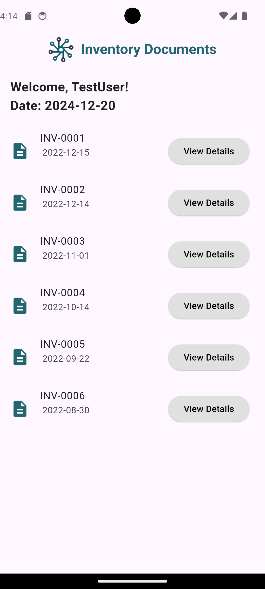

# **Octomiro Task App**

### **Project Overview**
The **Octomiro Task App** is a Flutter-based mobile application designed to simplify inventory management. It features a user-friendly interface for managing inventory documents, generating PDFs, and maintaining user authentication (sign-up and login).

---

## **Features**

1. **User Authentication**:
   - Sign-up page to create an account.
   - Login page to securely access the application.
   - Password validation (ensures matching passwords during sign-up).

2. **Inventory Management**:
   - Displays a list of inventory documents fetched from a JSON file.
   - Allows users to view details of each document, including:
     - Document ID
     - Date
     - Placement
     - Organization
     - Item details (name, code, description, quantity, and creator).

3. **PDF Generation**:
   - Users can generate a PDF for any inventory document directly from the app.
   - PDFs are stored locally on the device for easy access.

4. **Welcome Banner**:
   - Personalized greeting for the logged-in user, including the current date.

---

## **Technologies Used**

- **Flutter**: Framework for cross-platform mobile app development.
- **SQLite**: Used for storing and retrieving user data.
- **Dart**: Programming language for Flutter development.
- **PDF Package**: For generating PDF documents.
- **Path Provider**: To save files locally on the device.

---

## **Screenshots**

### **1. Login Page**
<<<<<<< HEAD

=======
  
>>>>>>> 9be11f3103006264a8a2a7abd4ee788830146fd6
- A sleek login page with email and password fields.
- Includes a button to navigate to the sign-up page.

### **2. Sign-Up Page**
<<<<<<< HEAD

=======
  
>>>>>>> 9be11f3103006264a8a2a7abd4ee788830146fd6
- Allows new users to create an account.
- Features fields for username, email, password, and password confirmation.

### **3. Inventory List Page**
<<<<<<< HEAD

=======
  
>>>>>>> 9be11f3103006264a8a2a7abd4ee788830146fd6
- Displays a list of inventory documents with details like document ID and date.
- Includes a "View Details" button for each document.

### **4. Document Details Page**
<<<<<<< HEAD

- Shows comprehensive details about the selected inventory document.
- Includes a button to generate a PDF of the document.

### **5. The PDF Generated**

- Shows the Pdf document genrated .

=======

- Shows comprehensive details about the selected inventory document.
- Includes a button to generate a PDF of the document.

>>>>>>> 9be11f3103006264a8a2a7abd4ee788830146fd6
---

## **Setup Instructions**

Follow these steps to run the app locally:

1. **Clone the Repository**:
   ```bash
   git clone <repository-url>
   cd octomiro_task


2. **Install Dependencies:**:
   ```bash
   flutter pub get


3. **Run the App:**:
   ```bash
   flutter run


4. **Using the Emulator:**
   Ensure you have set up an emulator or connected a physical device.
